# Git workshop

## What is Git
Is a Version Control System (VCS) created by Linus Torvalds (you may or may not know him as the creator of the Linux Operating system), allowing devs to keep track of changes on a given project, with mechanisms to allow rollback to previous versions and keep track of different project states.

It is currently the most used VCS in the world of development for it's relative simplicity and wide integration with various repositories based on it like GitHub and GitLab, widely used in the industry and OpenSource community as a colaborative tool, allowing people from different parts of the world to work as one. 

## Why should you care as a student?
You may not give much of an interest to it in this phase, there is WhatsApp and USB sticks that allow you to coop with your group members right? 

Well, for smaller projects and group members sure, but you are going to participate in bigger and bigger projects, with more and more people, so it eventually becomes almost mandatory to understand and use a version control system.

Not only that, but even for smaller projects it can work as a way to backup what has been done in case your dog decides to eat your laptop (ouch!). It also allows for someone who's a night owl to work on something while you're sleeping, and forgot to send the current state of the project over Discord you careless bastard.

## Need to know before proceeding
### Using commands
Git can be used with several graphical interfaces but usually tends to be used with terminal commands. The commands used tend to follow a specific syntax:

```
command <required> [optional]
```

- \<required\> -> necessary flags needed for the command to work
- [optional] -> other flags that can be used to address more specific parts of the command used

### Common references while using the file system

When using the Terminal to navigate or give refereces to commands, there are a few symbols used to refernce parts of your filesystem:
- ` . ` -> reference to the current directory you're in
- ` .. ` -> Parent directory of current directory you're in

To make sense, imagine you are in the Desktop path, so the absolute path should look like:  
` C:/Users/MyUser/Desktop `  
Your current directory is *Desktop* and the parent directory is *MyUser*.

## Setting things up
### Installing Git 
To use Git as your version control, first you need to install it. Go ahead and download it from the oficial site here: https://git-scm.com/.

After the installation is done, use this command on a terminal window:

```
git --version
```

If everything went well, you should get the version number reported as a response to that command.

### The text editor
We will be using VS Code due to the integration to version history and for better visibility of the steps being followed.

### Setting up your configuration
Let's create your identification for other to point their fingers at when mistakes are done. 

Most likely, your user name and email are not associated to git, and they are required to create the commits.

We can verify the existence of this information in your system using: 
```
git config --get user.name
```

```
git config --get user.email
```

If the configuration is not setup, then let's set it up. Use the *add* flag to the git command to add the information necessary:

```
git config --add --global --get user.name
```

```
git config --add --global --get user.email
```

We are also going to setup git's default branch to *main*  
> GitHub and other repositories now use *main* as the default branch, in the past *master* was used and may be set by default by git.
```
git config --global init.defaultBranch main
```

Lets run a command to verify what configs we have: 
```
cat ~/.gitconfig
```

The User Name and Email should be populated with what you have setup.

## Git Workflow
### Git Workflow Table

| --------- |\|        | Tracked  |          |
| --------- |         -| :------: | -------- |
| Untracked |\| Staged | Commited | Modified | 

When you first create a file locally in your system inside the git path, that file is:  
    - __Untracked__ -> Files that git is unaware exist;

Adding files using 'git add' to the the index makes them:  
    - __Staged__ -> Files added to the git index that can me commited to the remote repository  

Commiting the changes makes them:  
    - __Committed__ -> files are now part of the history of the repository.  

Editing a commited file in the local repository makes it:   
    - __Modified__ -> the file includes data that is not yet commited, but it exists in the repo.


### Simple commands you need to know

The following commands are what we are going to use most of the time when interacting with git: 

| Step | Command                   | Description |
|------|---------------------------|-------------|
| 1    | `git init`                | Initialize a new Git repository |
| 2    | `git clone <repository>`  | Clone an existing repository |
| 3    | `git status`              | Check the status of your working directory |
| 4    | `git add <file>`          | Add a file to the staging area |
| 5    | `git commit -m "message"` | Commit changes with a message |
| 6    | `git push`                | Push changes to the remote repository |
| 7    | `git pull`                | Pull changes from the remote repository |
| 8    | `git log`                 | View the commit history |
| 9    | `git switch`              | Change to a different branch. New branches can be created using -c |

## Getting Started...      finally

Let's get it cracking, shall we? Like it was said before, we are going to use terminal commands to operate and get to know Git, so open a git Bash CLI window (Windows) or terminal (Linux) in your computer, start by creating an empty folder in a location of your choice (for the sake of this workshop, create it in your Home folder or Desktop to make it simpler to follow) by using:  

```
mkdir workshop 
cd workshop 
```

> mkdir <folder_name> is the command to create a new folder  
> cd <folder_path> is the command to change the current directory to the one mentioned

Now enter the command `code .`, that will open Visual Studio Code in this directory.

Start by opening a terminal window inside VS Code:

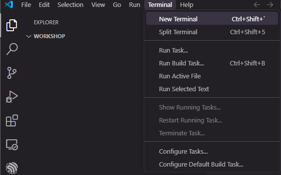 

Your VS Code should look like this:

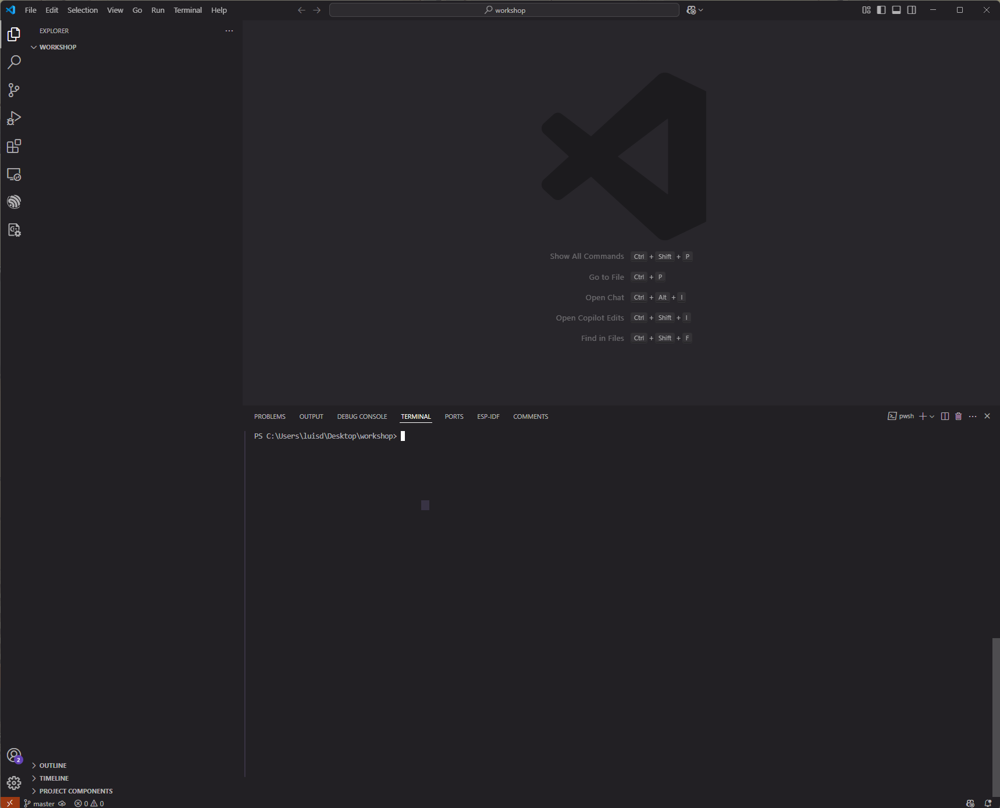

Once inside, we are going to type in the terminal window `git init`. A hidden folder called .git was created. **THIS** will be your whole Git, everything git related is here now and forever!

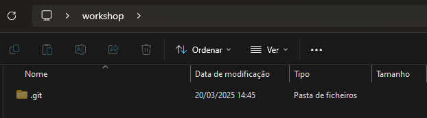

It is an empty repository for the time being, but it will have everything inside. You should not touch anything inside, just know it exiss.

## Your first file 

Now let's create a file to start. Click the "New File..."  
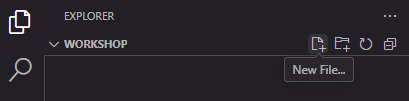   

and call it *contents.md* 

Let's leave it empty for now, and run the command in terminal:
`git status`

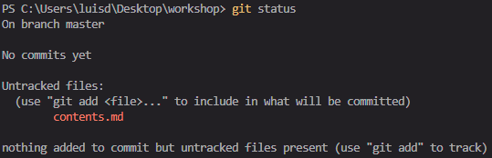

Notice our file is **Untracked**, meaning that Git is completely unaware of it's existance, and if erased from the local path, it's gone forever. to prevent this let's add it using `git add contents.md`. Using `git status` again we have:

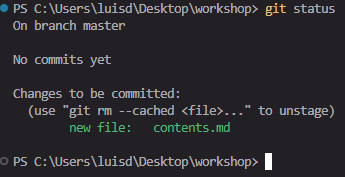

Our file is ready to commit! Let's do it using `git commit -m "My first commit"`. Now use `git log` to view your commit history:

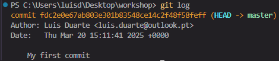

Notice thereºs a commit identifier with a bunch of random alphanumerical characters. This is called the commit Hash, and it includes every change to te file/files of that commit, as well as information of the Author, Date and the Message: this should be short but explanatory of the changes done.

Let's modify the contents of the file. Add the following text to the *contents.md* file: 

```
# This is a title

## This is a subtitle
```

When running `git status` we now have the file marked as **modified**.

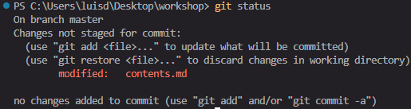

Let's proceed with adding it again with `git add contents.md`. Verify the state of the changes using `git status`:

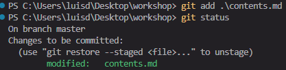

and if everything is checked and ready, commit using `git commit -m "Added content"`. The `git log` command should display 2 commits:

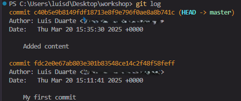

Notice the HEAD -> master will always point to the latest commit. This information can be read as "the HEAD of the master branch is at commit xyz123".

### Exercise 1

Create 3 new folders called "src", "inc" and "exec". Inside the "inc" folder create a file called "string.h" with the following content: 
```c
#ifndef _STRING_H_
#define _STRING_H_

#include <stdio.h>

void printString (const char *string);

#endif
```

Inside the "src" folder create a "string.c" with:
```c
#include "../inc/string.h"

void printString (const char *string){
    printf ("%s", string);
}
```

And in the main folder create a "main.c" with:
```c
#include "./inc/string.h"


int main () {
    printString(phrase);

    return (0);
}
```

Add, verify the status, and commit these changes with the message "Added Code".

## GitHub

Now we have created our very own local repository, but how can I share with others?

This is where GitHub comes in. GitHub is a repository hosting service owned by Microsoft, and uses Git to interact between your local repository and the remote.

### Creating the Remote repository

Inside te GitHub home page there should several options. In the "Repositories" we are going to press on "New"

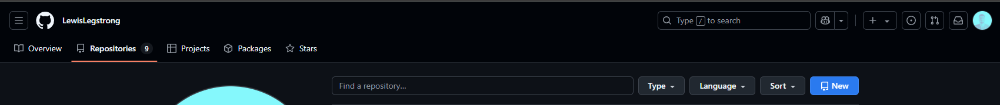

Name it "workshop" to match the folder name in desktop and click "Create Repository"

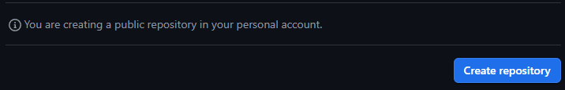

This repository exists in a computer somewhere in the world, empty with no files and no connection to your local repo. 

We will modify your local repository say it needs to connect to the remote one. In our terminal window in VSCode, we can copy and paste the commands for "Add an existing Repo" option. The commands are: 

- `git remote add origin git@github.com:LewisLegstrong/workshop.git` -> adds the "origin" repository as the one created on GitHub
- `git branch -M main` -> define the branch 
- `git push -u origin main` -> This will push all your local main branch to the remote origin repository

Now refresh your GitHub page and you should see the files pushed to the remote repository.

## Branches

Remember how Git is a version control system? Branches are a main part of it. 

We as developers will break stuff eventually, but can't afford to have a user experience that in any point in time we are making those changes.

Usually in development you want to have a branch that is stable, and if any user makes use of the content of that branch, it compiles everytime and is not broken. 

The ***main*** branch is commonly used for the Stable version of the application we are developing, and a ***dev*** branch is used for developers to work on new features and test things.

### Branching out 

Let's create a new branch that will be used to add a simple string. To do so use `git checkout -b featureA`, the **-b** flag will create a new branch and your "newFeature" branch will be created. Remember that you now that you have a remote repository, you need to make this change to the remote repoistory as well. Use `git push --set-upstream origin featureA` to push this new change to remote as well.

Let's now change back to the "main" branch by using `git checkout main`. You don't need the **-b** flag when changing between existing branches.
We changed back to "main" as we want this to be our base to the other branches we are creating.

Create a new branch using  `git checkout -b featureB` and set it's push origin as well using `git push --set-upstream origin featureB`.

We should now be working on branch "featureB". Let's modify "main.c" to fix the missing string in it.

On line 5 of main.c add `const char phrase[] = {"Hello World!"};`

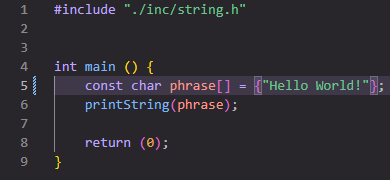

You can now add the changes to main.c to the index using `git add .\main.c` and commit using `git commit -m "Hello World added"`. Now that we are working with a remote repository in GitHub, we need to push this changes to that repository as well. For that we use `git push`. Check the GitHub page and verify the changes were made.

## Pull Request

Now, to the fun part! Create a pull request (or merge request) from GitHub's context menu and pressing the "New pull request" button.

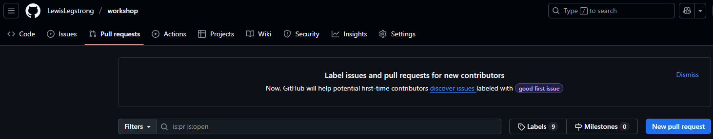

GitHub will verify for any conflicts that may exist, and it should go straight through and allow you to complete the merge. Press the "Merge pull request" to create a Merge commit.

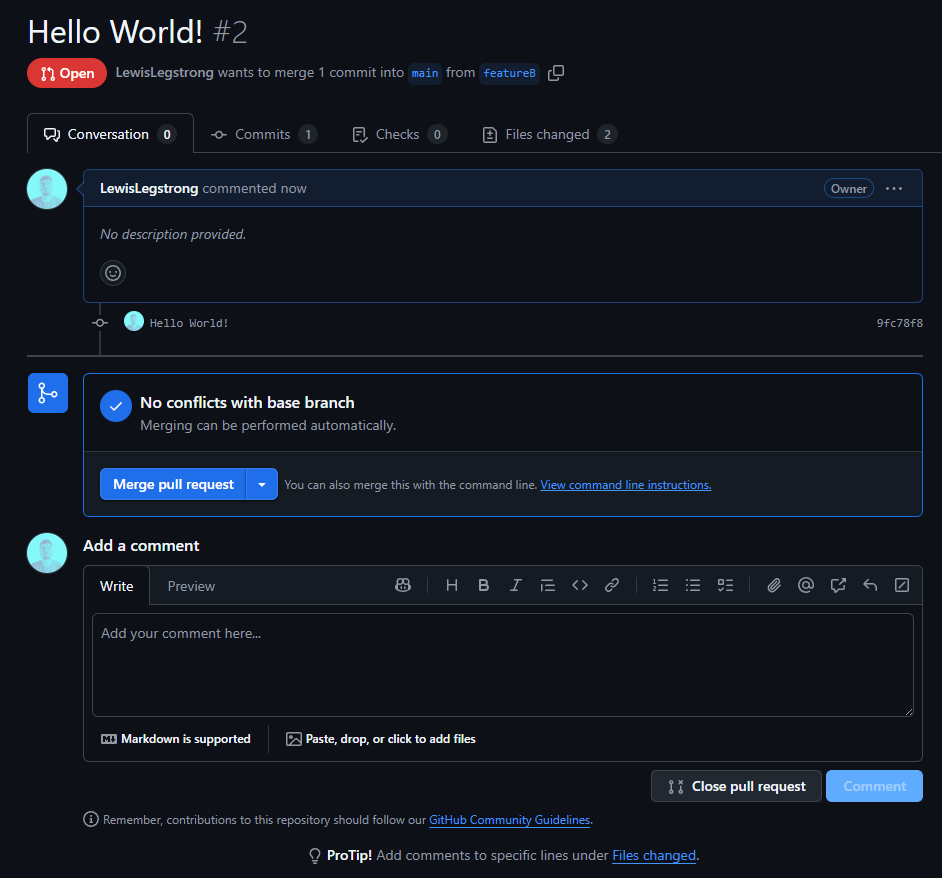

Main will now have the changes that were done to "featureB" shown here.

## The problem

Now main changed, but there's a branch that was created from main and isn't aware that main changed. We're talking about "featureA" branch. Let's change our working branch to it by using `git checkout featureA` and open the main.c file. Notice it still doesn't have the string variable added previously. Let's add the string variable but this time add `const char phrase[] = {"Hello Engineers!"};`. 

Follow the normal workflow by doing `git add .\main.c`, and commit with `git commit -m "Hello Engineers added"`. Remember the remote repository, so `git push` will be used again. Check the GitHub page and verify the changes were made.

Now that our feature allows the program to work, we want to merge with "main" again, so let's start a new pull request from "featureA" to "main".

Notice that this time GitHub detected conflicts! 

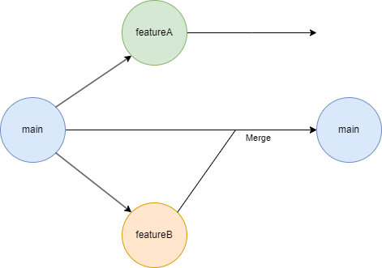

Git expects linear timeline, yet notice how "main" was modified with the previous merge and "featureA" didn't take notice of it, and there's now a line in exactly the same spot with something, creating the conflict. Now we need to resolve it before being able to complete the merge request.

To solve this issue, we need to change the parent commit that preceeds the branch creation. To do that, in VSCode, make sure you're in the branch that has the modifications that you want to merge, in this case "featureA" by using `git branch`. We now use `git rebase origin/main` as we want to fix the issue on the remote repository. By doing this, notice that you have some indications in the main file on VSCode. This will tell you what is currently in the HEAD of the "main" branch and what changes are local to the branch you want to merge. We want the new feature in "featureA" to go through, so we accept the Current Changes. Now that we have selected what changes to keep, let's use `git add .\main.c` and verify the satus: 

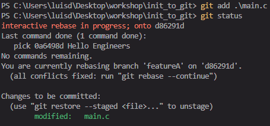

Notice the message now states "all conflicts fixed" meaning we can procede. 

Rebase detaches your work branch from the branch it's based from, so it's like "featureA" is floating orphan of a parent commit and it needs to be attached again. **DO NOT COMMIT AT THIS STAGE**, do `git rebase --continue` so that your branch knows where it's working from: 

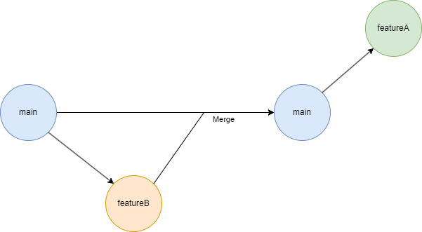

So what you did was effectivelly change the parent of the branch to be the new commit merge from "featureB" to "main", making the timeline linear again. To complete the changes remotely, we now need to do `git push --force-with-lease`, the  `--force-with-lease` flag is meant to force the push to occur, as the HEAD changed, but keep linearity in its history.

You can now complete the merge request on GitHub and the changes have now been updated to "main"!

## Conclusion 

You should now be fully capable of using Git extensively and interact with remote repositories, following good practices and making use of all necessary commands for cooperation and version control.

Luis Barrão - a20478@aluno.ipca.pt

